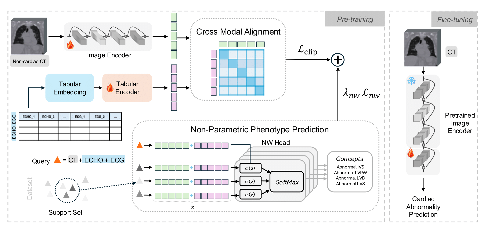

# X-Cardia: Phenotype-Guided Cross-Modal Alignment for Opportunistic Cardiac Screening on Routine Chest CT

**MIDL 2026**  
*Under Review*

This repository contains the official PyTorch implementation of **X-Cardia**, a phenotype-guided multimodal learning framework for opportunistic cardiac screening from **non-gated, non-contrast chest CT**.

X-Cardia aligns chest CT with structured **ECHO and ECG phenotypes** during pre-training using contrastive learning and a **non-parametric Nadaraya–Watson (NW) head**, producing transferable and interpretable CT representations for downstream cardiac abnormality prediction.

---

##  Key Contributions

- Phenotype-guided multimodal alignment between CT, ECHO, and ECG  
- Non-parametric **Nadaraya–Watson head** for exemplar-based phenotype supervision  
- Strong gains in **few-shot learning** (up to 11.8% AUROC improvement in 5-shot)  
- Enables **opportunistic cardiac screening** using routine chest CT  
- Interpretable representations with **cardiac-focused Grad-CAM** attention  

---

##  Method Overview

<p align="center">
  
</p>

During **pre-training**, X-Cardia aligns CT and tabular representations using:
- CLIP-style multimodal contrastive loss  
- Phenotype-level supervision via a Nadaraya–Watson head  

During **fine-tuning**, only the CT encoder is used to predict cardiac abnormalities from chest CT.

---

##  Code Structure

- `Pretrain/` – Multimodal contrastive learning with NW head  
- `Finetune/` – Supervised CT-only downstream training  

---

##  Pretrained Model Weights

We provide pretrained X-Cardia model weights obtained via phenotype-guided multimodal pre-training on paired chest CT, ECHO, and ECG data.

> **Note:** Model weights are released for **research use only** and contain **no patient-identifiable information**.

### Available Checkpoints

| Model | Description | Download |
|------|------------|----------|
| X-Cardia (NW + MMCL) | CT encoder pretrained with phenotype-guided multimodal alignment | [Download](https://drive.google.com/drive/folders/1n33YOO6_U5ZG4ynL1BPvLElXWLfZZ5Zu?usp=drive_link) |

### Checkpoint Details

- **Backbone:** 3D ResNet-50  
- **Pre-training data:** Paired non-contrast chest CT + ECHO + ECG  
- **Losses:** CLIP-style contrastive loss + Nadaraya–Watson phenotype loss  
- **Input resolution:** 2 mm isotropic, center-cropped volumes  

### Loading Pretrained Weights

```python
checkpoint = torch.load("best_NW_Head_05.pth", map_location="cpu")
model.load_state_dict(checkpoint["state_dict"], strict=False)
